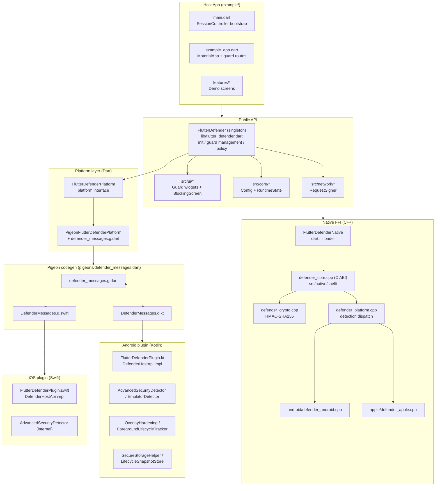
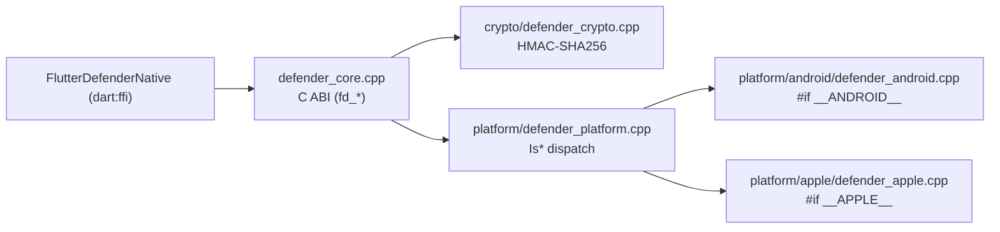
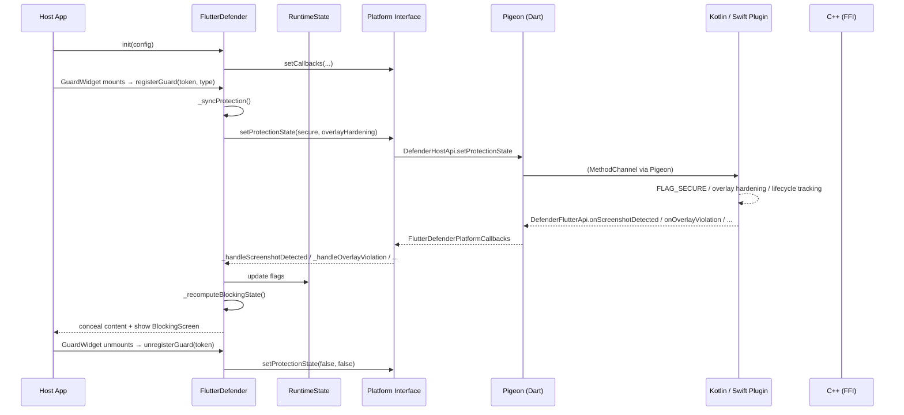

# flutter_defender — Project Structure & Node Connections

> Security layer for Flutter apps on **Android** and **iOS**. Protects guarded screens
> against overlay/tapjacking attacks, task hijacking, screenshots / screen capture,
> background session abuse, and emulator execution.

This document maps the repository: the main nodes, what each does, and how they are
connected at runtime.

---

## 1. High-Level Architecture



---

## 2. Directory Map (with responsibilities)

```
flutter_defender/                     # The plugin package
├── lib/                              # Dart API of the plugin
│   ├── flutter_defender.dart         # ★ Public facade / singleton (uses `part` files)
│   ├── flutter_defender_platform_interface.dart  # PlatformInterface abstraction
│   ├── flutter_defender_localization_support.dart # Locale merge / RTL helpers
│   ├── l10n/                         # ARB (en, ar, es, fr) + generated localizations
│   └── src/
│       ├── controller/               # ★ State machines (parts of flutter_defender.dart)
│       │   ├── flutter_defender_init.dart
│       │   ├── flutter_defender_guard_management.dart
│       │   ├── flutter_defender_platform_safety.dart
│       │   ├── flutter_defender_policy_blocking.dart
│       │   └── flutter_defender_policy_sync.dart
│       ├── core/
│       │   ├── flutter_defender_config.dart       # Immutable init config
│       │   └── flutter_defender_runtime_state.dart # Mutable runtime flags
│       ├── native/
│       │   └── flutter_defender_native.dart        # dart:ffi → C++ bridge
│       ├── network/
│       │   └── flutter_defender_request_signer.dart # HMAC request signing
│       ├── platform/
│       │   ├── pigeon_flutter_defender_platform.dart # Default platform impl
│       │   └── pigeon/defender_messages.g.dart     # Generated Host/Flutter API
│       └── ui/
│           ├── blocking_screen.dart
│           ├── flutter_defender_guard_widgets.dart # Guard widgets
│           ├── flutter_defender_blocking_ui.dart
│           ├── flutter_defender_message_id.dart
│           ├── flutter_defender_messages.dart
│           └── flutter_defender_ui_theme.dart
│
├── pigeons/
│   └── defender_messages.dart        # ★ Single source for the native API contract
│
├── src/native/                       # Shared C++ core (FFI library)
│   ├── include/flutter_defender/     # Public headers (crypto, platform)
│   └── src/
│       ├── ffi/defender_core.cpp     # C ABI exports (fd_*)
│       ├── crypto/defender_crypto.cpp # HMAC-SHA256
│       └── platform/
│           ├── defender_platform.cpp # Detection dispatch
│           ├── platform_detector_internal.h
│           ├── android/defender_android.cpp
│           └── apple/defender_apple.cpp
│
├── android/                          # Android plugin (Kotlin)
│   └── src/main/kotlin/aleem/flutter/defender/
│       ├── FlutterDefenderPlugin.kt
│       ├── DefenderMessages.g.kt     # Generated
│       ├── AdvancedSecurityDetector.kt
│       ├── EmulatorDetector.kt
│       ├── ForegroundLifecycleTracker.kt
│       ├── LifecycleSnapshotStore.kt
│       ├── OverlayHardening.kt
│       ├── SecureStorageHelper.kt
│       └── ReleaseEmulatorGuardActivity.kt
│
├── ios/                              # iOS plugin (Swift)
│   └── flutter_defender/Sources/flutter_defender/
│       ├── FlutterDefenderPlugin.swift
│       ├── FlutterDefenderNativeLinker.swift
│       ├── DefenderMessages.g.swift  # Generated
│       └── PrivacyInfo.xcprivacy
│
├── example/                          # Demo / integration host app
│   ├── lib/main.dart                 # Bootstrap + SessionController
│   ├── lib/src/app/example_app.dart  # MaterialApp + guarded routes
│   ├── lib/src/app/session/          # session_controller.dart, defender_demo_profiles.dart
│   ├── lib/src/features/home/        # home_screen.dart
│   ├── lib/src/features/security/    # demo_screens.dart (Sensitive/OTP/Custom/...)
│   ├── lib/src/shared/widgets/       # demo_widgets.dart, security_widgets.dart
│   └── integration_test/             # plugin_integration_test.dart
│
├── test/                             # Dart unit tests
│   ├── flutter_defender_guard_test.dart
│   ├── flutter_defender_request_signer_test.dart
│   └── native/defender_crypto_test.cpp
│
└── tool/                             # Repo automation scripts
    ├── check_android_root_path_parity.py
    └── check_version_bump.py
```

---

## 3. Nodes and Their Connections

### 3.1 Public API — `FlutterDefender` (singleton)

- **File:** `lib/flutter_defender.dart`
- **Role:** The single coordination point. Implements `WidgetsBindingObserver` + `Listenable`.
- **Connections:**
  - Implements **init flow** via `part` file `src/controller/flutter_defender_init.dart`.
  - Manages the active guard registry (`_activeGuards`) via `flutter_defender_guard_management.dart`.
  - Pushes policy decisions (blocking UI) via `flutter_defender_policy_blocking.dart`.
  - Handles lifecycle / background timeouts via `flutter_defender_policy_sync.dart`.
  - Talks to native safely via `flutter_defender_platform_safety.dart`.
  - Holds `FlutterDefenderRuntimeState` (core) and `FlutterDefenderConfig` (core).
  - **Exports** localization support, `FlutterDefenderRequestSigner`, blocking screen,
    message ids, messages, and UI theme so host apps can consume them.

### 3.2 Platform Interface — `FlutterDefenderPlatform`

- **File:** `lib/flutter_defender_platform_interface.dart`
- **Role:** `PlatformInterface` contract abstracting the real implementation so it can be
  swapped/mocked in tests.
- **Connections:**
  - Default static instance = `PigeonFlutterDefenderPlatform`
    (`src/platform/pigeon_flutter_defender_platform.dart`).
  - Declares all native operations: `setProtectionState`, `getRuntimeState`,
    `getAdvancedSecuritySignals`, secure storage (`secureWrite/Read/Delete/ClearAll`),
    lifecycle snapshots, and `setCallbacks`.

### 3.3 Pigeon Contract — `pigeons/defender_messages.dart`

- **Role:** Single source of truth for the native API. Generates three artifacts:
  - `lib/src/platform/pigeon/defender_messages.g.dart` (Dart)
  - `android/.../DefenderMessages.g.kt` (Kotlin)
  - `ios/.../DefenderMessages.g.swift` (Swift)
- **Connections:**
  - **`DefenderHostApi`** (Dart → native): protection state, runtime state, advanced
    security signals, secure storage, lifecycle snapshots.
  - **`DefenderFlutterApi`** (native → Dart): `onScreenshotDetected`,
    `onScreenCaptureChanged`, `onOverlayViolation`, `onOverlayCleared`,
    `onForegroundStateChanged`, `onWindowFocusChanged`.
- **Note:** Pigeon messages also carry the shared `NativeRuntimeState`, `LifecycleSnapshot`,
  and `AdvancedSecuritySignals` model types used across the Dart/native boundary.

### 3.4 Dart Core

| Node | File | Responsibility | Connected to |
|---|---|---|---|
| `FlutterDefenderConfig` | `src/core/flutter_defender_config.dart` | Immutable options (timeouts, feature toggles, callbacks, UI theme, locale, message resolvers). Includes the `ignoreScreenBlocking` bypass toggle. | Built by `init`, read by controller parts and UI. |
| `FlutterDefenderRuntimeState` | `src/core/flutter_defender_runtime_state.dart` | Mutable runtime flags (foreground, capture, blocking sources, authentication, timers) + `DefenderBlockingSource` / `FlutterDefenderGuardType` enums. | Mutated by controller handlers, consumed by guard widgets & blocking UI. |

### 3.5 Controller Parts (the state machines)

All are `part of flutter_defender.dart` and extend the `FlutterDefender` class:

| Part | File | Role | Connections |
|---|---|---|---|
| Init | `controller/flutter_defender_init.dart` | Validates & stores config (including `ignoreScreenBlocking`), registers native callbacks, boots protection, drains pending init requests. | Reads config; wires `FlutterDefenderPlatformCallbacks`; calls `_syncProtection`. |
| Guard management | `controller/flutter_defender_guard_management.dart` | `registerGuard` / `unregisterGuard` registry (`_activeGuards`), computes active guard kind. | Called by guard widgets on mount/unmount; drives `_syncProtection`. |
| Platform safety | `controller/flutter_defender_platform_safety.dart` | Wraps native calls in try/catch (fail-open/fail-closed), merges FFI emulator signal with Pigeon runtime state. | Calls `FlutterDefenderPlatform` + `FlutterDefenderNative`. |
| Policy blocking | `controller/flutter_defender_policy_blocking.dart` | Priority-ordered blocking state (`_recomputeBlockingState`): platform unavailable → emulator → root → proxy/VPN → tampering → screen capture → … → shows blocking UI. | Reads `RuntimeState`, renders blocking via UI layer. |
| Policy sync | `controller/flutter_defender_policy_sync.dart` | Foreground/background timeout enforcement, OTP pops, logout requests, cold-start lifecycle snapshot replay. Gates native protection activation on `ignoreScreenBlocking`. | Uses lifecycle callbacks, secure-storage clear, `_requestLogout`; calls `_safeSetProtectionState` only when blocking is enforced. |

### 3.6 Guard Widgets & Blocking UI

- **Files:** `src/ui/flutter_defender_guard_widgets.dart` (guards + concealment placeholder),
  `src/ui/blocking_screen.dart` (`BlockingScreen`), `src/ui/flutter_defender_blocking_ui.dart`.
- **Guard widgets:** `FlutterDefenderSensitiveGuard`, `FlutterDefenderSecureContentGuard`,
  `FlutterDefenderOtpGuard`.
- **Connections:**
  - Each guard **registers itself** with the `FlutterDefender` singleton when mounted and
    unregisters when disposed (`registerGuard` / `unregisterGuard`).
  - Guards subscribe to the runtime notifier; while a guard is active, protected content is
    **concealed** (`shouldConcealGuardedContent`) and replaced with the blocking UI.
  - When `ignoreScreenBlocking: true` (exposed as `FlutterDefender.screenBlockingIgnored`),
    the guard skips concealment entirely, `hasBlockingOverlay` /
    `shouldConcealGuardedContent` both return `false`, and native hardening is not
    enabled — detection still runs and callbacks (`onRootDetected`,
    `onProxyOrVpnDetected`, `onTamperingDetected`) still fire.
  - The OTP guard additionally exposes a `popRoute` used by timeout policy.
  - Styling comes from `FlutterDefenderUiTheme`; copy comes from
    `FlutterDefenderMessages` + generated localizations via `FlutterDefenderMessageId`.

### 3.7 Native FFI Bridge

- **File:** `lib/src/native/flutter_defender_native.dart`
- **Role:** Loads the C++ shared library with `dart:ffi` and exposes
  `NativeDefenderSignals`, `detectEmulator()`, `collectSignals()`, `signHmacSha256Hex()`.
- **Connections:**
  - Calls the C ABI in `src/native/src/ffi/defender_core.cpp`
    (`fd_is_debugger_attached`, `fd_is_rooted_or_jailbroken`, `fd_is_emulator`,
    `fd_is_tampered`, `fd_hmac_sha256_hex`, `fd_free_string`).
  - Consumed by **platform safety** (emulator signal) and by **request signer** (HMAC).

### 3.8 Network — Request Signer

- **File:** `lib/src/network/flutter_defender_request_signer.dart`
- **Role:** Canonical request payload signing for outbound API calls.
- **Connections:** Uses `FlutterDefenderNative.signHmacSha256Hex` to produce
  `X-Defender-Timestamp` / `X-Defender-Signature` headers.

### 3.9 Shared C++ Core



- **`defender_core.cpp`** — the only exported surface; wraps crypto + detection.
- **`defender_crypto.cpp`** — HMAC-SHA256 digest + hex copy.
- **`defender_platform.cpp`** — routes detection (`IsDebuggerAttached`, `IsRootedOrJailbroken`,
  `IsEmulator`, `IsTampered`) to a platform implementation via `platform_detector_internal.h`.
- **`defender_android.cpp`** / **`defender_apple.cpp`** — platform-specific detection
  (filesystem heuristics, `sysctl`, `/proc`, etc.).

### 3.10 Android Plugin (Kotlin)

- **Entry:** `FlutterDefenderPlugin.kt` implements `FlutterPlugin`, `ActivityAware`, and the
  generated `DefenderHostApi`.
- **Connections:**
  - Sets up Pigeon (`DefenderHostApi.setUp`) and owns the `DefenderFlutterApi` for
    callbacks back to Dart.
  - `OverlayHardening` — intercepts window callbacks to detect overlay violations and
    block tapjacking on guarded screens.
  - `ForegroundLifecycleTracker` — reports foreground/background changes.
  - `ScreenCaptureCallback` — detects screenshots / capture state.
  - `AdvancedSecurityDetector` / `EmulatorDetector` — root, proxy/VPN, debugger, tampering,
    emulator signals.
  - `SecureStorageHelper` — encrypted key/value store.
  - `LifecycleSnapshotStore` — persists backgrounded-at / authenticated / guard kind
    across process death (used for cold-start replay).
  - `ReleaseEmulatorGuardActivity` — optional launcher activity that blocks release builds
    on emulators **before** Flutter starts.

### 3.11 iOS Plugin (Swift)

- **Entry:** `FlutterDefenderPlugin.swift` implements the generated `DefenderHostApi`.
- **Connections:**
  - Owns `DefenderFlutterApi` for native→Dart callbacks.
  - Internal `IosAdvancedSecurityDetector` — jailbreak detection, proxy/VPN, debugger,
    hooking/tampering.
  - Screen-capture detection (recording/mirroring) and app-state provider for
    foreground/focus handling; conceals content on backgrounding.
  - `FlutterDefenderNativeLinker.swift` — links the shared C++ core into the iOS build.
  - `PrivacyInfo.xcprivacy` — required privacy manifest.

### 3.12 Example Host App

- **`main.dart`** — creates `SessionController`, registers a logout handler, applies the
  active demo profile, and runs `MyApp`.
- **`example_app.dart`** — `MaterialApp` whose routes wrap demo screens in the guard widgets:
  - `/sensitive` → `FlutterDefenderSensitiveGuard` + `SensitiveDemoScreen`
  - `/custom-blocking` → guard + `CustomBlockingDemoScreen`
  - `/otp` → `FlutterDefenderOtpGuard` + `OtpDemoScreen`
  - `/authenticated` → guard + `AuthenticatedDemoScreen`
  - Registers the plugin's localizations delegates and merges supported locales.
- **`session/session_controller.dart`** + **`defender_demo_profiles.dart`** — drive OTP /
  background-timeout demos and logout flows.
- **`features/security/presentation/demo_screens.dart`** — the guarded demo content
  (secret cards, checklists).

---

## 4. Runtime Data Flow (end to end)



---

## 5. Generation & Tooling

| Artifact | Source | Tool |
|---|---|---|
| `defender_messages.g.dart` | `pigeons/defender_messages.dart` | `pigeon` (`pubspec` dev dep) |
| `DefenderMessages.g.kt` | `pigeons/defender_messages.dart` | `pigeon` |
| `DefenderMessages.g.swift` | `pigeons/defender_messages.dart` | `pigeon` |
| `l10n/flutter_defender_localizations*.dart` | `lib/l10n/app_*.arb` | Flutter gen-l10n (`l10n.yaml`) |
| `check_android_root_path_parity.py` | — | Ensures native include paths stay in sync (CI) |
| `check_version_bump.py` | — | Validates version bumps on release (CI) |
| `test/native/defender_crypto_test.cpp` | — | C++ unit tests for the crypto core |

---

## 6. Key Design Notes

- **Guard-driven, not route-observer driven.** A screen protects itself by wrapping
  content in a guard widget; the guard registers with the singleton on mount. There is no
  global `RouteObserver` dependency.
- **Two native channels coexist:**
  1. **Pigeon/MethodChannel** — rich, structured plugin API (state, storage, callbacks).
  2. **FFI (C++)** — lightweight detection + HMAC, shared across platforms via a single
     C ABI and platform-`#ifdef` implementations.
- **Fail-open vs fail-closed:** native calls are wrapped (`platform_safety`) so a native
  failure can either conceal (fail-closed) or degrade gracefully (fail-open) depending on
  `failClosedOnPlatformError`.
- **Opt-out for development:** `ignoreScreenBlocking` (set in `init`) suppresses
  concealment, the blocking screen, and native hardening (`FLAG_SECURE` / iOS secure
  surface) while keeping detection and callbacks active, giving a grace/debug mode
  without touching the policy engine (`_recomputeBlockingState` still runs and records
  blocking state; both the UI layer and `_syncProtection` honor the bypass). Defaults
  to `true` in debug/profile builds and `false` in release builds.
- **Cold-start resilience:** `LifecycleSnapshot` (written on background) is replayed on
  launch so an OTP/session timeout can be enforced even after the process was killed.
